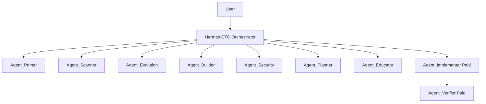

# Agent Org Chart and Execution Flow

## Org Chart

## Frozen Flow

1. User completes required org onboarding.
2. User starts audit for a repository.
3. Hermes runs `Agent_Primer` in Daytona.
4. User completes required 5-question project onboarding with primer-assisted defaults.
5. Hermes runs core audit pipeline:
   - `Agent_Scanner` (static + architecture)
   - `Agent_Evolution` (behavioral Git signals)
   - `Agent_Builder` (runtime probes)
   - `Agent_Security` (validation)
6. Hermes runs synthesis pipeline:
   - `Agent_Planner` (prioritized remediation plan)
   - `Agent_Educator` (audience-specific explanation)
7. System emits:
   - executive summary
   - categorized findings
   - prioritized roadmap
   - coding-agent handoff prompt
8. If paid implementation is enabled:
   - `Agent_Implementer` executes fixes
   - `Agent_Verifier` re-runs checks and publishes deltas

## Core Guarantees

- Deep-audit execution plane is Daytona.
- Project onboarding is required before audit starts.
- Primer cache is commit-aware.
- Behavioral analysis is explicit via `Agent_Evolution`.
